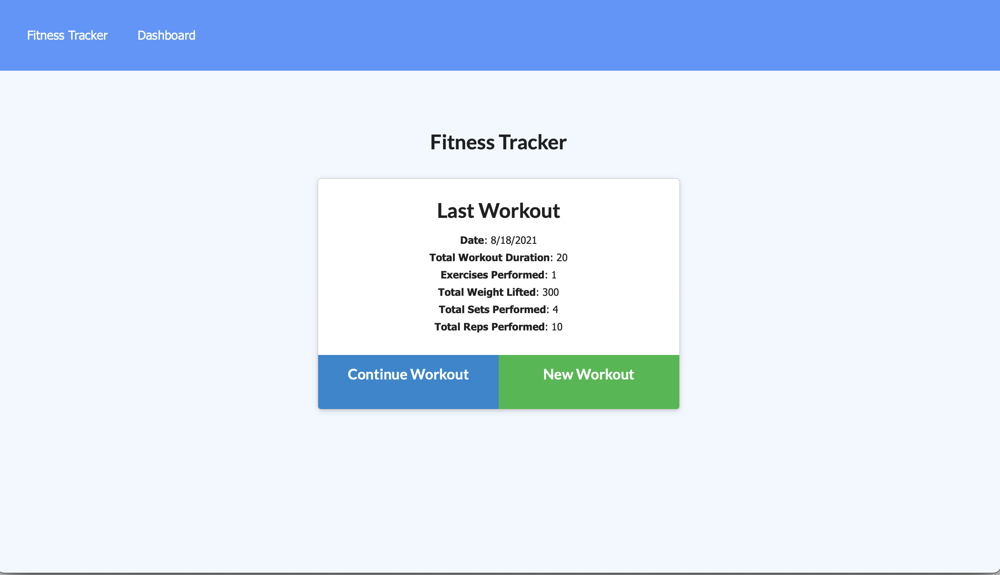
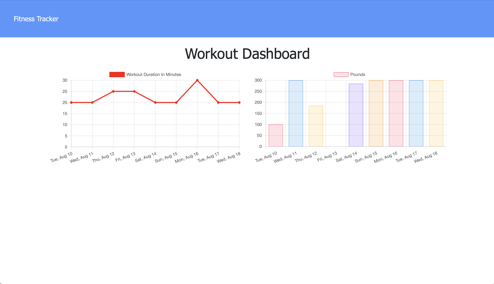
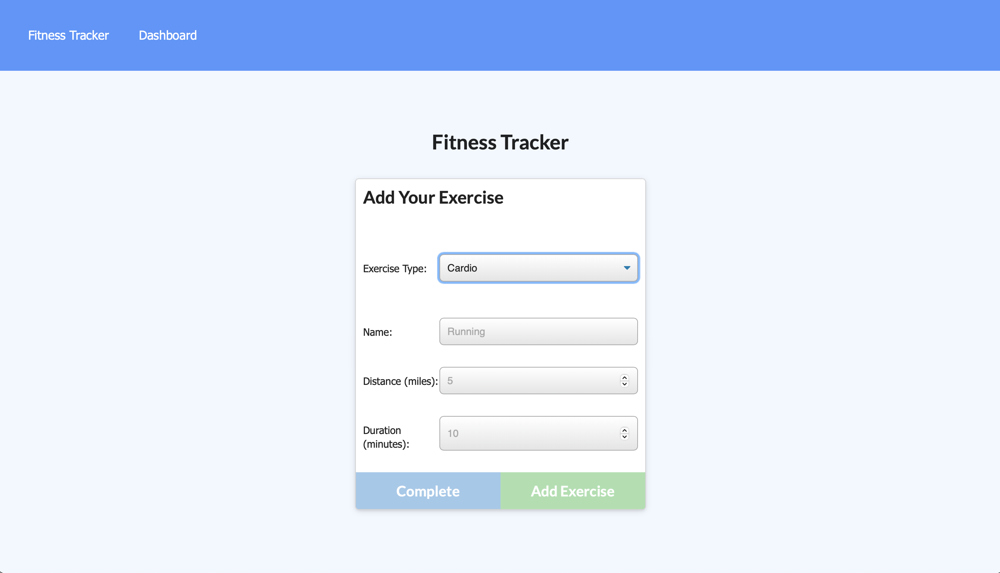

<h1 align="center">Workout Tracker 👋</h1>

 

## Description

🔍 Workout-Tracker provides the user with plenty of functionality to help them reach their fitness goals. Users are able to Log multiple exercises in a workout.
Track the name, type, weight, sets, reps, and duration of each exercise. Track the distance traveled if the exercise was cardio based, and view past workouts.

## Table of Contents

- [Description](#description)
- [Installation](#installation)
- [Usage](#usage)
- [License](#license)
- [Contributing](#contributing)
- [Tests](#tests)
- [Questions](#questions)

## Installation

💾 Run npm i in the root directory and also have MongoDB installed and ready.

## Usage

💻 The application best serves those interested in exercise by allowing users to create workout plans by adding different exercises. This helps users to track their fitness goals.

## License

 
This application is covered by the MIT license.

## Contributing

👪 Ethan Morris

## Tests

✏️ No tests are included.

## Questions

✋ Contact me or submit an issue 
 
:octocat: Find me on GitHub: [Gimbalbyte](https://github.com/Gimbalbyte) 
 
✉️ Email me with any questions: ethan.morris571@gmail.com  

Images

